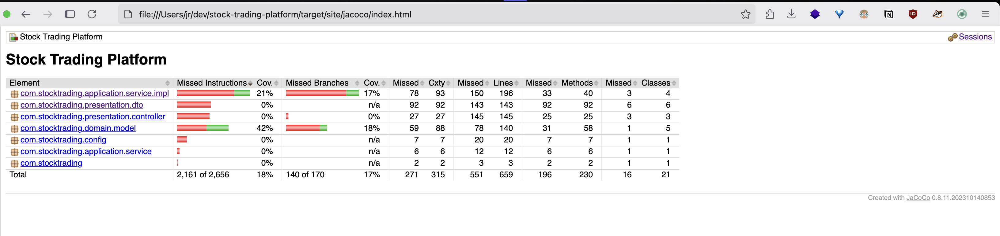
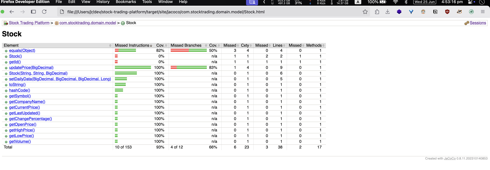

# Stock Trading Platform

A full-stack stock trading platform built with **Spring Boot** (backend) and **Next.js + TypeScript + Tailwind CSS** (frontend). This application demonstrates modern software architecture principles including **SOLID principles**, **modular design**, and **comprehensive testing**.

## 🏗️ Architecture & Design Principles

### SOLID Principles Implementation

- **Single Responsibility Principle**: Each class has one reason to change

  - `StockPriceService` only handles stock price operations
  - `TradingService` only handles trading operations
  - `PortfolioService` only handles portfolio management

- **Open/Closed Principle**: Open for extension, closed for modification

  - Service interfaces allow for different implementations
  - `MockStockPriceServiceImpl` can be replaced with real API implementation

- **Liskov Substitution Principle**: Derived classes are substitutable for base classes

  - Any implementation of `StockPriceService` can replace `MockStockPriceServiceImpl`

- **Interface Segregation Principle**: Clients depend only on interfaces they use

  - Separate interfaces for different concerns (`StockPriceService`, `TradingService`, etc.)

- **Dependency Inversion Principle**: Depend on abstractions, not concretions
  - Services depend on interfaces, not concrete implementations
  - Constructor injection for loose coupling

### KISS (Keep It Simple, Stupid) Principle

- Clear, readable code with meaningful names
- Simple domain models with focused responsibilities
- Straightforward API design following RESTful conventions
- Minimal but effective frontend design

## 🚀 Features

- **Real-time Stock Data**: Mock stock price management with live updates
- **Portfolio Management**: Track holdings, gains/losses, and performance
- **Trade Execution**: Buy and sell stocks with validation
- **Trade History**: Complete audit trail of all transactions
- **Responsive UI**: Modern, mobile-friendly design with Tailwind CSS
- **Type Safety**: Full TypeScript implementation
- **Error Handling**: Comprehensive error handling and validation

## 🛠️ Technology Stack

### Backend

- **Spring Boot 3.2.1** - Main framework
- **Spring Data JPA** - Data persistence
- **Spring Security** - Security framework
- **H2 Database** - In-memory database for development
- **Maven** - Dependency management
- **JUnit 5 + Mockito** - Testing framework

### Frontend

- **Next.js 14** - React framework
- **TypeScript** - Type safety
- **Tailwind CSS** - Styling
- **React Query** - Server state management
- **React Hook Form** - Form handling
- **Axios** - HTTP client

## 🏃‍♂️ Getting Started

### Prerequisites

- Java 17+
- Node.js 18+
- Maven 3.6+

### Backend Setup

1. **Navigate to project root**:

   ```bash
   cd stock-trading-platform
   ```

2. **Run the Spring Boot application**:

   ```bash
   mvn spring-boot:run
   ```

   The backend will start on `http://localhost:8080`

3. **Access H2 Database Console** (optional):
   - URL: `http://localhost:8080/h2-console`
   - JDBC URL: `jdbc:h2:mem:stocktrading`
   - Username: `sa`
   - Password: `password`

### Frontend Setup

1. **Navigate to frontend directory**:

   ```bash
   cd frontend
   ```

2. **Install dependencies**:

   ```bash
   npm install
   ```

3. **Start the development server**:

   ```bash
   npm run dev
   ```

   The frontend will start on `http://localhost:3000`

## 🧪 Testing

### Backend Tests

Run all tests:

```bash
mvn test
```

Run with coverage report:

```bash
mvn test jacoco:report
```

Coverage report will be available at: `target/site/jacoco/index.html`

### Test Coverage

The application includes comprehensive tests demonstrating:

- **Unit Tests**: Testing individual components in isolation
- **Integration Tests**: Testing component interactions
- **Mocking**: Using Mockito for dependency isolation
- **Test-Driven Development**: Tests written to drive design





Key test classes:

- `StockTest` - Domain model tests
- `TradingServiceImplTest` - Service layer tests with mocking
- `PortfolioServiceImplTest` - Business logic tests

### Frontend Tests

```bash
cd frontend
npm run test
```

## 📊 API Documentation

### Stock Endpoints

- `GET /api/stocks` - Get all stocks
- `GET /api/stocks/{symbol}` - Get stock by symbol
- `GET /api/stocks/search?query={query}` - Search stocks
- `PUT /api/stocks/{symbol}/price` - Update stock price

### Trading Endpoints

- `POST /api/trades/buy` - Execute buy order
- `POST /api/trades/sell` - Execute sell order
- `GET /api/trades/user/{userId}` - Get user trades
- `POST /api/trades/validate` - Validate trade

### Portfolio Endpoints

- `GET /api/portfolio/user/{userId}` - Get user portfolio
- `GET /api/portfolio/user/{userId}/summary` - Get portfolio summary

## 🏗️ Project Structure

### Backend Structure

```
src/main/java/com/stocktrading/
├── domain/
│   ├── model/          # Domain entities (Stock, Trade, Portfolio)
│   └── repository/     # Repository interfaces
├── application/
│   └── service/        # Service interfaces and implementations
├── presentation/
│   ├── controller/     # REST controllers
│   └── dto/           # Data Transfer Objects
└── config/            # Configuration classes

src/test/java/         # Test classes
```

### Frontend Structure

```
frontend/src/
├── components/        # React components
├── pages/            # Next.js pages
├── services/         # API services
├── types/           # TypeScript type definitions
└── styles/          # CSS styles
```

## 🔧 Configuration

### Backend Configuration (`application.yml`)

- Database configuration
- Security settings
- Logging configuration
- Actuator endpoints

### Frontend Configuration

- API base URL configuration
- Tailwind CSS customization
- Next.js configuration

## 🌟 Key Features Demonstrating Testability

1. **Dependency Injection**: All dependencies are injected, making components easily testable
2. **Interface-Based Design**: Services depend on interfaces, allowing easy mocking
3. **Pure Domain Logic**: Business logic is separated from infrastructure concerns
4. **Comprehensive Validation**: Input validation at multiple layers
5. **Error Handling**: Proper exception handling with meaningful error messages

## 🔮 Future Enhancements

- Real-time price updates with WebSockets
- User authentication and authorization
- Advanced charting and technical analysis
- Order types (limit, stop-loss, etc.)
- Risk management features
- Performance analytics
- Mobile app development

## 🤝 Contributing

1. Fork the repository
2. Create a feature branch (`git checkout -b feature/amazing-feature`)
3. Commit your changes (`git commit -m 'Add some amazing feature'`)
4. Push to the branch (`git push origin feature/amazing-feature`)
5. Open a Pull Request

## 📝 License

This project is licensed under the MIT License - see the [LICENSE](LICENSE) file for details.
